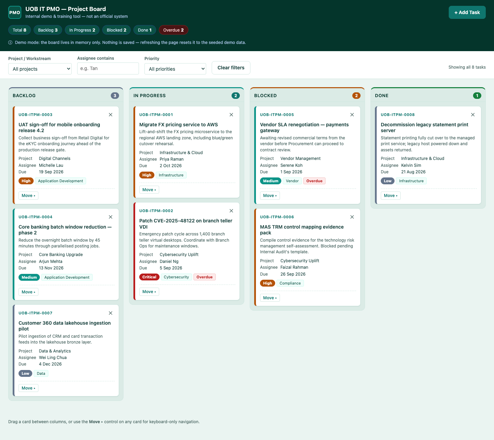

# UOB IT PMO — Project Board

A single-page Kanban board for a fictional internal IT PMO, built as a demo and
training tool. The whole application is one HTML file with no build step and no
dependencies.

**Live demo: https://joinlianjie1985-collab.github.io/itprojectmanagement/**



> This is not an official system. The organisation, the projects and the people named
> on the board are all fictional, and no real logos or trademarks are used.

## Running it locally

Download or clone the repository and double-click `index.html`. That is the whole
setup — it runs straight from `file://`, with no server, no install and no build.

```sh
git clone https://github.com/joinlianjie1985-collab/itprojectmanagement.git
open itprojectmanagement/index.html
```

## What it does

- **Four columns** — Backlog, In Progress, Blocked and Done, each with a count badge
  and its own accent colour. Colour is a secondary cue only; every column is also
  labelled, so nothing depends on colour alone.
- **Add tasks** through a modal form with a title, description, project, category,
  assignee, priority and due date. Validation errors appear inline under each field.
- **Move cards** by dragging them between columns, or through a keyboard-accessible
  move menu on each card.
- **Delete cards** with an inline "Delete? Yes / No" confirmation rendered into the
  card itself.
- **Filter** the board by project, assignee or priority, and clear all filters at once.
- **Summary strip** in the header showing the total task count, the count per status,
  and how many tasks are overdue.
- **Overdue highlighting** for any card past its due date that is not yet Done.
- **Email notification** on new tasks, sent through FormSubmit's AJAX endpoint.
- **Responsive layout** that stacks the columns below 768px.
- **Accessible by construction** — WCAG AA contrast on all text, a visible focus ring
  that is never removed, sequential heading levels, and `prefers-reduced-motion`
  respected on card hover.

## Notes on how it is built

These are deliberate constraints of the exercise rather than accidents:

- **Vanilla only.** No framework, no bundler, no npm, no build step.
- **One file.** All markup, CSS and JavaScript live in `index.html`.
- **No external resources.** System fonts, Unicode glyphs and inline SVG only.
  `formsubmit.co` is the single permitted network origin.
- **No persistence.** Board state is an in-memory array — no `localStorage`, no
  cookies, no database. Refreshing the page resets it to the seed data, which is
  intended behaviour and is called out in the header.
- **Rendered from a single source of truth.** All state lives in one `state` object
  and the board is rebuilt from it on every change; every interpolated value is
  escaped before it reaches `innerHTML`.

`CLAUDE.md` documents the architecture in more detail, for anyone (or any agent)
making changes.

## Email notifications

New-task notifications go through [FormSubmit](https://formsubmit.co). To enable them,
set `FORMSUBMIT_ENDPOINT` near the top of the script block in `index.html` to your own
address, then submit one task — FormSubmit emails a one-time confirmation link, and
nothing is delivered until you click it. Notifications are optional: the board works
normally without them, and a failed send only produces a warning toast.

## Deployment

Every push to `main` triggers `.github/workflows/deploy-pages.yml`, which publishes
`index.html` to GitHub Pages. Only the app itself is served — the project docs and
workflow files stay in the repository.
